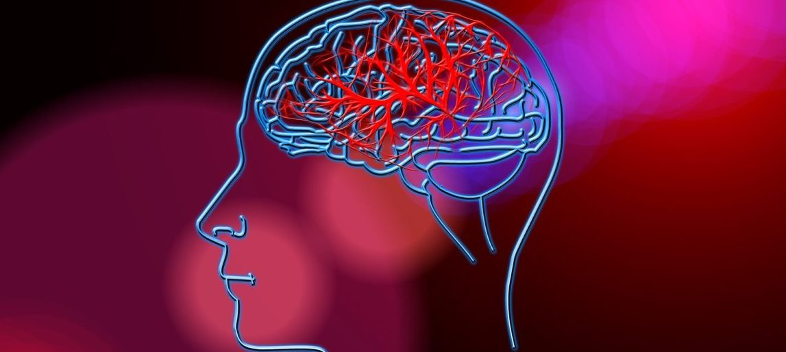

# Stroke Predictions Model
**Authors: Anisha Malhotra and Jaclyn Dwyer**

# Overview
This project examines data, obtained from Kaggle, regarding risk factors for strokes. 
According to the CDC, strokes are the fifth leading cause of death in the United States. 
The goal of this project is to create a model that screens if a patient is at risk for a stroke. 
Therefore, the models will be evaluated using recall scores in order to minimize false negatives.

# Methods
The methodology for this project includes data cleaning, exploratory data analysis, feature engineering, 
and running various models to determine the model with the highest recall score.

# Exploratory Data Analysis
Graphs are created to explore the relationships between stroke risk factors and strokes.

This graph shows that the number of strokes increases as age increases.

At a normal glucose level (less than 140), no strokes are more prominent than strokes. On the other hand, 
at pre-diabetic (between 140 and 200) and diabetic levels (greater than 200), strokes are more prevalent than no strokes.

# Feature Engineering
Features are engineered including a "heart_rf" feature to take into account the cumulative heart risk factors.
The percentage of people who had a stroke for each category was calculated as follows: 
no heart risk factors- 0.03%, one heart risk factor- 13%, both heart risk factors- 20%.

The graph shows that those with both heart risk factors (hypertension and heart disease) have 
a much higher incidence of strokes than those with no heart risk factors.

# Model

## Class Imbalance

There is a strong class imbalance between no stroke and stroke in the dataset. This is accounted for using tomek links and SMOTE.

## Model Evaluation 

This dataframe shows Logistic Regression Model 6 and 7 perform the best on the test data, as these two models have the highest
test recall scores.

# Final Model

Logistic Regression Model 6 is the best model for screening whether the patient is at risk for having a stroke. 
The goal for this model is to catch as many people as possible who will have a stroke. 
By doing this, interventions can be put in place allowing patients to take measures in order to prevent having a stroke. 
Therefore, it is preferred that patients be falsely caught for having a stroke rather than missing patients who will have a 
stroke. On the test data about 56% of the patients were false positives, however, further screenings would prove the patient 
to be healthy. More importantly, the final model was able to catch about 92% of patients who had a stroke.

